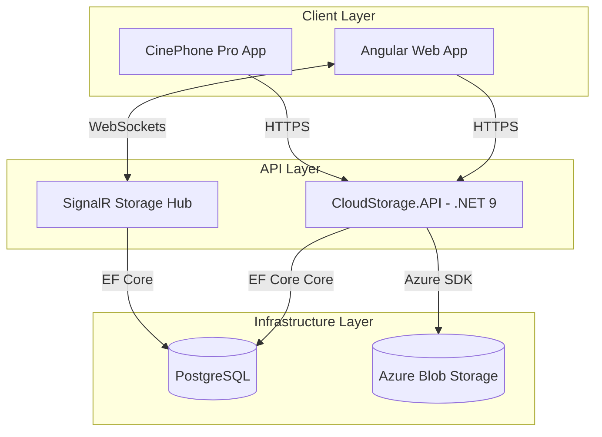
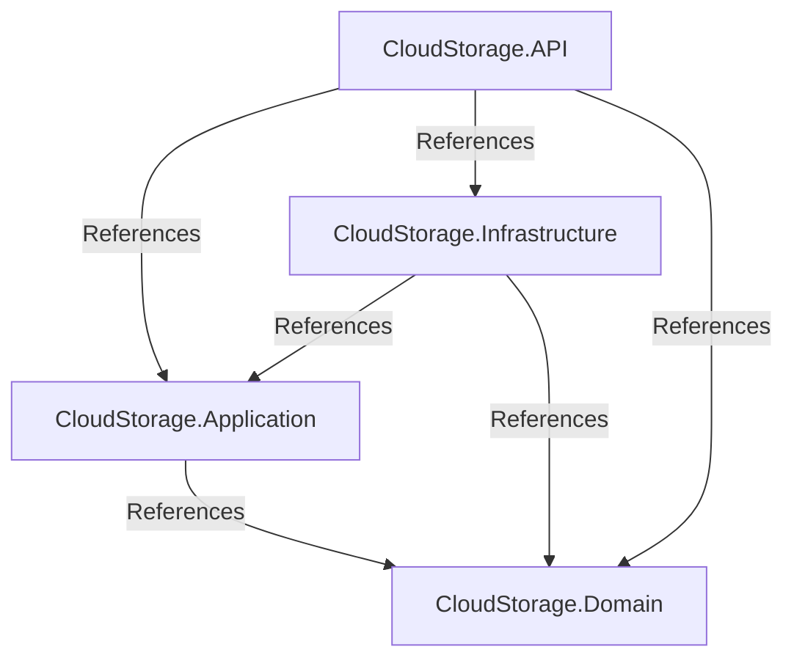
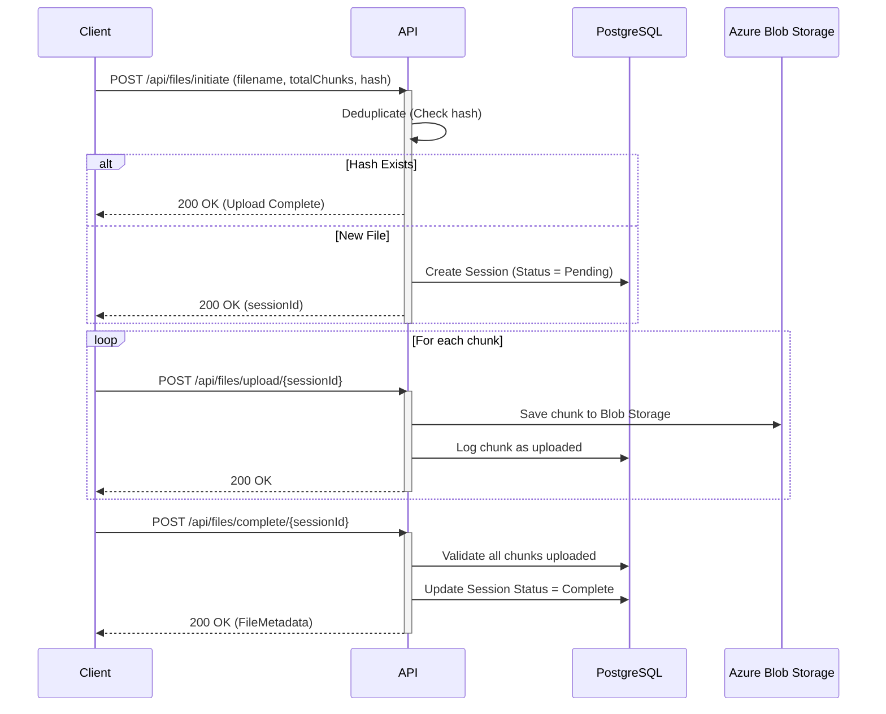
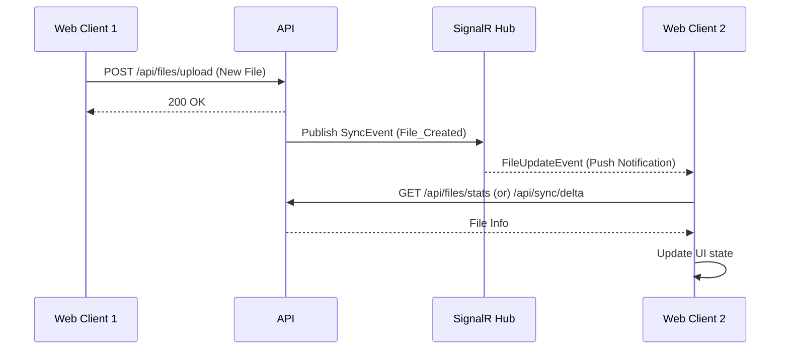
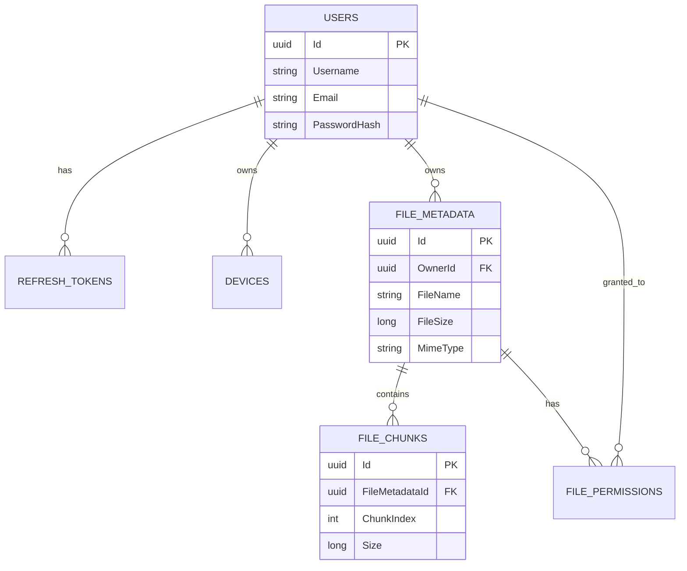

# System Architecture Diagrams

This document contains visual representations of the system architecture for the Distributed Cloud Storage Platform.

## 1. High-Level Architecture

The system utilizes a split frontend/backend architecture, with the backend built on .NET 9 and PostgreSQL, and the frontend on Angular 21.

## 2. Clean Architecture Pattern

The backend is structured using Clean Architecture to decouple business logic from infrastructure concerns.

## 3. Chunked File Upload Flow

File uploads are handled by breaking the file into 5MB chunks and uploading them directly to Azure Blob Storage via SAS tokens (or processed by the backend if local storage is used).

## 4. Real-Time Sync Flow

Real-time synchronization uses SignalR to allow the client to instantly react to file updates made from other devices or browsers.

## 5. Entity Relationship Model

A simplified view of how entities relate to one another in the PostgreSQL database.

