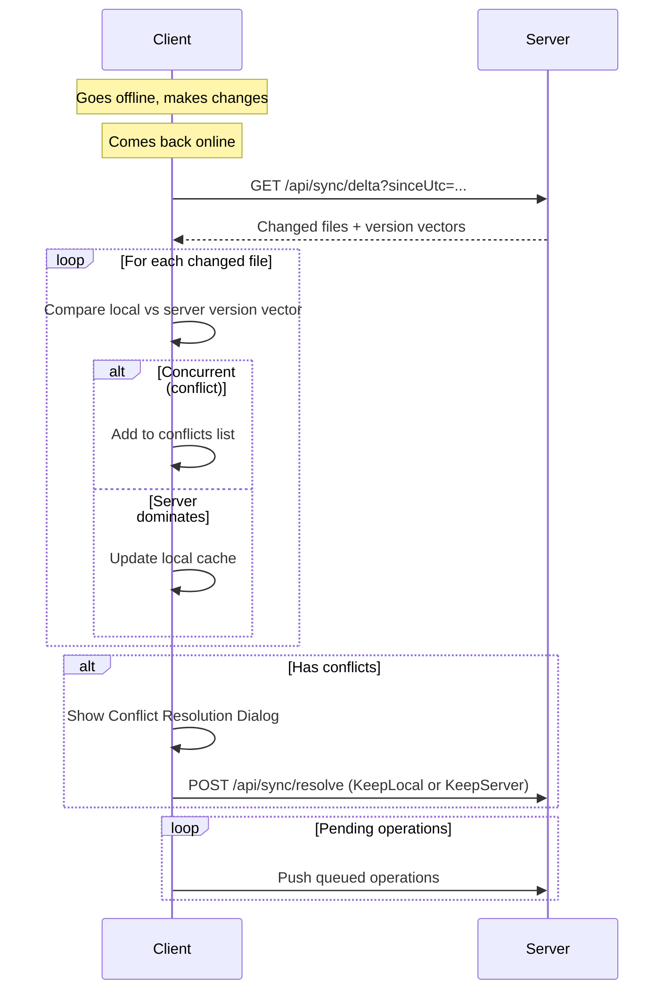

# Offline Capabilities & Conflict Resolution

## Architecture Overview

This document describes the offline-first architecture and conflict resolution system implemented in the Cloud Storage platform.

---

## 1. Offline Mode

### Local Cache (IndexedDB)

The Angular client uses **IndexedDB** (via `OfflineCacheService`) with two object stores:

| Store | Purpose |
|-------|---------|
| `fileMetadata` | Cached file list with version vectors |
| `pendingOperations` | Queued offline operations |

When the user is online, every `getFiles()` call writes the response to IndexedDB. When offline, the file list loads from cache.

### Connection Detection

`ConnectionStatusService` uses `navigator.onLine` + window events to expose a signal-based `isOnline` state. The main layout shows an amber banner when offline.

### Pending Operations Queue

Offline actions (deletes, renames) are queued in IndexedDB and replayed in order when connectivity is restored.

---

## 2. Version Vectors

Each `FileMetadata` stores a `VersionVector` field — a JSON-serialized `Dictionary<string, int>` where keys are device/client IDs and values are monotonically increasing counters.

### Conflict Detection Algorithm

Two version vectors are **concurrent** (conflicting) when **neither dominates** the other:

```
Vector A dominates B ⟺ ∀ key: A[key] ≥ B[key] AND ∃ key: A[key] > B[key]
Concurrent ⟺ NOT(A dominates B) AND NOT(B dominates A)
```

### Example

```
Client vector: { "laptop": 3, "phone": 1 }
Server vector: { "laptop": 2, "phone": 2 }
→ laptop: 3 > 2 (client ahead)
→ phone:  1 < 2 (server ahead)
→ CONFLICT (concurrent edits)
```

---

## 3. Sync Flow



---

## 4. Conflict Resolution

When a conflict is detected, the user is presented with a dialog showing:

- **File name** and modification times (local vs server)
- **Keep Local** — merges the client's version vector into the server's
- **Keep Server** — discards local changes, pulls server version
- **Batch actions** — "Keep All Local" or "Keep All Server" for multiple conflicts

---

## 5. API Endpoints

| Method | Endpoint | Description |
|--------|----------|-------------|
| `POST` | `/api/sync/check-conflicts` | Check if a file has concurrent version vectors |
| `POST` | `/api/sync/resolve` | Resolve a conflict (KeepLocal=0, KeepServer=1) |
| `GET`  | `/api/sync/delta?sinceUtc=` | Get files changed since timestamp |

---

## 6. Key Files

### Backend
- `FileMetadata.cs` — `VersionVector` field
- `ConflictDetectionService.cs` — Version vector comparison & merge logic
- `ConflictController.cs` — REST API for conflict operations
- `ConflictDtos.cs` — Request/response DTOs

### Frontend
- `offline-cache.service.ts` — IndexedDB file metadata cache
- `connection-status.service.ts` — Online/offline signal
- `sync-engine.service.ts` — Orchestrates sync, conflict detection, pending ops
- `conflict-dialog.component.ts` — UI for resolving conflicts
