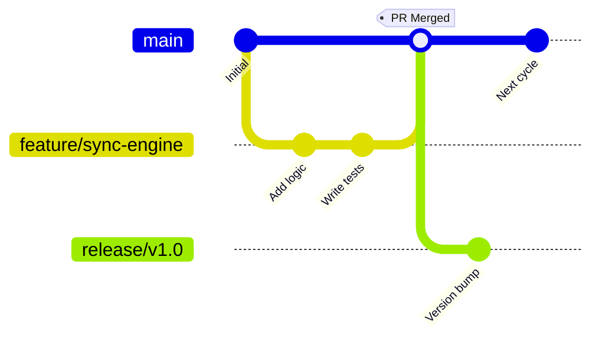
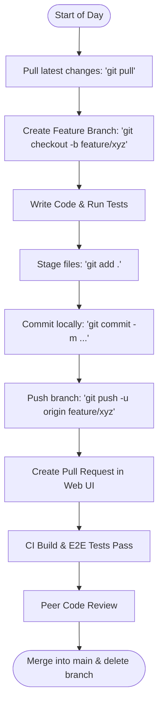

# Team Foundation Version Control (TFVC) to Git Migration Guide

This document serves as the definitive guide for migrating source code repositories from Team Foundation Version Control (TFVC) to Git. It details the conceptual shift, prep steps, conversion process, repository sanitization (removing TFS bindings), post-migration configurations, branching strategies, and developer training.

---

## 1. The Paradigm Shift: TFVC vs. Git

Moving from TFVC to Git is not just a change of tooling; it is a fundamental shift in how version control is conceived and practiced.

| Dimension | TFVC (Centralized) | Git (Distributed) |
| :--- | :--- | :--- |
| **Architecture** | **Central Server Database:** The server holds the history. Your local workspace is merely a working copy of a specific version. | **Distributed Graph:** Every clone is a complete repository containing the full project history, branch history, and metadata. |
| **Unit of Change** | **Changeset:** Paths and files updated together. System tracks file-level changes. | **Commit:** A snapshot of the entire project tree, tracked as a node in a Directed Acyclic Graph (DAG). |
| **Branching** | **Path-Based:** A branch is a physical folder path in the repository (e.g., `$/Project/Dev`). Merges require copying changes between directories. | **Pointer-Based:** A branch is a lightweight 40-character pointer referencing a specific commit. Merging computes the common ancestor. |
| **Concurrency** | **Locking Model:** Relies on server-side locks (Exclusive Checkouts) to prevent concurrent editing of the same file. | **Optimistic Merge Model:** Developers edit concurrently. Git's automated merging handles conflicts locally upon pull/push. |
| **Connectivity** | **Online Required:** Most operations (history, branches, diffs, commits) require connection to the TFS server. | **Offline Capability:** Almost all operations are local. Network connection is only needed for `push`, `fetch`, and `pull`. |

---

## 2. Pre-Migration Preparation

Before running any migration tools, you must clean up the source TFVC repository to prevent dead history, orphaned shelvesets, or corrupted imports.

### 2.1 Clean Up the TFVC Workspace
1. **Discard or Check In Shelvesets:** TFVC shelvesets **do not migrate** to Git. Developers must either check in their shelvesets or discard them.
2. **Resolve All Pending Merges:** Check in all open branches and resolve active merge conflicts in TFVC.
3. **Undo Pending Checkouts:** Make sure no files are left checked out/locked by inactive developers.
4. **Identify Active Branches:** Do not migrate deprecated folders or dead branches. Archive them within TFVC and only target active branches (e.g., `Main`, `Release-*`, and active `Feature` branches).

### 2.2 Define Sizing Constraints
Git is optimized for source code, not binary storage.
- A Git repository should ideally be under **1 GB** (maximum **5 GB** for performance reasons).
- Identify large files (e.g., SQL `.mdf`, NuGet `.nupkg` files, `.zip`, `.dll` binaries) and plan to exclude them from history or handle them via Git LFS (Large File Storage).

### 2.3 Prepare User Mapping (`authors.txt`)
In TFVC, authors are stored as domain usernames (e.g., `DOMAIN\jdoe`). Git identifies authors using `Name <email>` (e.g., `John Doe <john.doe@company.com>`). You must create an author mapping text file to map these identities.

Create a file named `authors.txt` with the following structure:
```text
DOMAIN\jdoe = John Doe <john.doe@company.com>
DOMAIN\asmith = Alice Smith <alice.smith@company.com>
TFS_Default_User = System Integration <devops@company.com>
```

> [!TIP]
> You can extract a list of all unique contributors from TFVC history by running a command-line query against TFS history, or export them from your Active Directory.

---

## 3. Migration Tool Selection

There are two primary methods to migrate TFVC to Git:

### Option A: Azure DevOps Built-in Import (Best for Simple Repos)
* **What it is:** A web UI feature inside Azure DevOps Repos.
* **Pros:** Fast, simple, web-based, runs in the cloud.
* **Cons:** Limited to **180 days of history** on the target branch. Does **not** import multiple TFVC branches (only imports one branch as `main`).

### Option B: `git-tfs` CLI (Best for Full History & Branches)
* **What it is:** An open-source, community-maintained command-line bridge between TFS and Git.
* **Pros:** Imports the **complete history** (all changesets, commit messages, dates). Handles **TFS branch mappings** and converts them to Git branches. Supports author mapping files.
* **Cons:** Must be run locally; can be slow for very large repositories with deep histories.

> [!IMPORTANT]
> For production migrations where historical context is required, **`git-tfs`** is the recommended standard. The steps below focus on this tool.

---

## 4. Execution Step-by-Step (Using `git-tfs`)

### Step 1: Install Prerequisites
Open an administrative PowerShell console and install Git and `git-tfs` (using [Chocolatey](https://chocolatey.org/)):
```powershell
choco install git git-tfs -y
```
Alternatively, download the binaries from the [git-tfs Releases Page](https://github.com/git-tfs/git-tfs/releases).

Ensure the executable is in your system `PATH` by running:
```powershell
git tfs --version
```

### Step 2: Clone the TFVC Repository
Identify the TFVC path for your main trunk (e.g., `$/CloudStorage/Main`) and choose a local path for the Git repo.

#### Scenario A: Migrate Only Main (No branches, full history)
Run the following command:
```powershell
git tfs clone https://tfs.yourdomain.com/tfs/DefaultCollection $/CloudStorage/Main "D:\Migrations\CloudStorage" --authors="D:\Migrations\authors.txt"
```

#### Scenario B: Migrate Main with All Active Branches
If your TFVC structure has designated branch relationships, run:
```powershell
git tfs clone https://tfs.yourdomain.com/tfs/DefaultCollection $/CloudStorage/Main "D:\Migrations\CloudStorage" --with-branches --authors="D:\Migrations\authors.txt"
```

> [!NOTE]
> The cloning process checks out every changeset sequentially. For repos with $>10,000$ changesets, this can take several hours. Run this on a stable machine with high-speed disk access.

### Step 3: Bootstrap TFS Branches
If you migrated branches in Scenario B, navigate to the directory and link the remote TFS branch metadata:
```powershell
cd D:\Migrations\CloudStorage
git tfs bootstrap
```
This maps the TFS hierarchy to Git branches, allowing you to run `git checkout` on former TFVC branches.

---

## 5. Post-Migration Cleanup & Cleansing

Once the repository is locally converted to Git, you must strip out the old Team Foundation Version Control metadata. TFVC injects tracking files and configurations that will pollute the Git repository.

### 5.1 Remove TFVC Source Control Files
Run a PowerShell command in the repository root to recursively find and delete TFVC configuration files (e.g., `.scc`, `.vspscc`, and `.vssscc` files):

```powershell
# Remove TFS source control files
Get-ChildItem -Path . -Include *.scc, *.vspscc, *.vssscc -Recurse -Force | Remove-Item -Force

# Verify that the local TFS workspace directory ($tf) is removed
if (Test-Path -Path ".\$tf") {
    Remove-Item -Path ".\$tf" -Recurse -Force
}
```

### 5.2 Clean the Solution File (`.sln`)
TFVC writes integration sections into Visual Studio Solution files. You must remove them to prevent Visual Studio from attempting to connect to the TFVC server.

1. Open the solution file (e.g., [CloudStorage.sln](file:///d:/college/cloud-storage/CloudStorage.sln)) in a text editor.
2. Locate the `GlobalSection(TeamFoundationVersionControl)` block, which looks like this:
   ```text
   GlobalSection(TeamFoundationVersionControl) = preSolution
       SccNumberOfProjects = 6
       SccEnterpriseProvider = {4CA58AB2-18FA-4F8D-95D4-32DDF27D184C}
       SccTeamFoundationServer = https://tfs.yourdomain.com/tfs/defaultcollection
       SccLocalPath0 = .
       SccProjectUniqueName1 = CloudStorage.API\\CloudStorage.API.csproj
       ...
   EndGlobalSection
   ```
3. **Delete this entire block** (from `GlobalSection(...)` to `EndGlobalSection`).
4. Save the file.

### 5.3 Clean Project Files (`.csproj`)
Legacy MSBuild configurations sometimes contain source control bindings.
1. Inspect your `.csproj` files (e.g., `CloudStorage.API.csproj`, `CloudStorage.Infrastructure.csproj`).
2. Search for and remove the following XML elements if present:
   ```xml
   <SccProjectName>SAK</SccProjectName>
   <SccProvider>SAK</SccProvider>
   <SccAuxPath>SAK</SccAuxPath>
   <SccLocalPath>SAK</SccLocalPath>
   ```

---

## 6. Git Infrastructure Configuration

### 6.1 Set Up `.gitignore`
A properly configured `.gitignore` is critical to prevent binaries, temp folders (`bin/`, `obj/`, `node_modules/`), and user settings (`.vs/`, `.idea/`, `.vscode/`) from polluting Git.

Create or verify the existence of a `.gitignore` in your root folder. Refer to the existing [.gitignore](file:///d:/college/cloud-storage/.gitignore) which contains comprehensive rules for:
* **Visual Studio / .NET**: Excluding `bin/`, `obj/`, `*.user`, `*.suo`, and `TestResults/`
* **NodeJS / Frontend**: Excluding `node_modules/`, `dist/`, and npm logs
* **TFS Metadata**: Explicitly ignoring `$tf/` folders, `*.vspscc`, `*.vssscc`, and `*.scc` configurations.

### 6.2 Set Up `.gitattributes`
To prevent cross-platform line ending discrepancies (Windows uses `CRLF`, macOS/Linux use `LF`), add a `.gitattributes` file to the root of the repository:

```text
# Handle line endings automatically for files detected as text
# and leave binary files untouched.
* text=auto

# Denote all files that are truly text and should be normalized to LF on checkout
*.cs text eol=crlf
*.json text
*.ts text
*.tsx text
*.css text
*.html text
*.md text
*.yml text
*.yaml text

# Denote files that are binary and should not be modified
*.png filter=lfs diff=lfs merge=lfs -text
*.jpg filter=lfs diff=lfs merge=lfs -text
*.zip filter=lfs diff=lfs merge=lfs -text
*.dll -text
```

---

## 7. Large File Management (Git LFS)

If history contains large binary files (e.g., assets, images, databases $>50\text{MB}$), you should configure **Git LFS** (Large File Storage) to prevent cloning operations from downloading redundant binary histories.

### 7.1 Enable Git LFS
Run the following in the repository:
```powershell
git lfs install
```

### 7.2 Track Large Formats
Specify which file types Git LFS should manage:
```powershell
git lfs track "*.zip"
git lfs track "*.mdf"
git lfs track "*.dll"
```
This updates the `.gitattributes` file. Ensure this file is committed:
```powershell
git add .gitattributes
git commit -m "chore: configure Git LFS tracking for binaries"
```

### 7.3 Rewrite History (Optional)
If large files are already baked into historical TFVC changesets, use **`git-filter-repo`** to strip them from your local Git history *before* pushing to remote:
```powershell
# Exclude a specific large folder or file from history
git filter-repo --path-glob '**/binaries/*.zip' --invert-paths
```

---

## 8. Branching and Workflow Strategies

Unlike TFVC, where branching is heavy and discouraged, Git encourages a highly interactive branching model.

### 8.1 Recommended Branching Model: Trunk-Based Development
For modern teams (such as those building the `CloudStorage` platform), **Trunk-Based Development** is recommended:
1. **`main` Branch:** Represents the stable, deployable state of the application. Direct commits to `main` are strictly blocked.
2. **Short-Lived Feature Branches:** Created from `main` (e.g., `feature/user-auth-fix`). Developer commits changes locally and pushes them to the remote server.
3. **Pull Requests (PRs):** Merge requests are opened from feature branches to `main`. They trigger automated builds, run tests (such as Playwright E2E suites), and require peer approval before merging.



### 8.2 Establish Branch Policies
Set up policies on the remote host (Azure Repos, GitHub, GitLab) for the `main` branch:
* **Require Pull Requests:** No direct pushing to `main`.
* **Required Reviewers:** Minimum of 1–2 peer approvals.
* **Build Validation:** Linked CI pipeline must compile the project successfully and pass all unit/E2E tests before merge is allowed.
* **Merge Requirements:** Enforce squash-merges to keep the commit history clean and linear.

---

## 9. Reconfiguring CI/CD Pipelines

TFVC builds rely on path triggers (e.g., trigger when files in `$/CloudStorage/Main` change). These must be updated to target Git refs.

### 9.1 Mapping Triggers
Update your CI/CD configuration (e.g., GitHub Actions workflow or `azure-pipelines.yml`) to define Git triggers:

```yaml
trigger:
  branches:
    include:
      - main
      - release/*
  paths:
    exclude:
      - docs/*
      - README.md
```

### 9.2 Build Tasks Adjustment
* **Agent Checkout:** In Git pipelines, ensure the runner checks out submodules if applicable (`checkout: self` with `submodules: true`).
* **Clean Option:** Ensure the workspace is cleaned (`git clean -fdx`) before compilation starts to avoid stale artifact interference.

---

## 10. Developer Onboarding Cheat Sheet

Help developers translate their TFVC habits to Git patterns.

### 10.1 Command Equivalencies

| Objective | TFVC Pattern | Git Command |
| :--- | :--- | :--- |
| **Get Latest** | Get Latest Version | `git pull` |
| **Stage Changes** | Implicit (all changes in workspace) | `git add <file>` |
| **Save Locally** | *No equivalence* (must check-in to server) | `git commit -m "message"` |
| **Upload to Server** | Check In | `git push` |
| **Save Temp Work** | Shelve | `git stash` |
| **Retrieve Temp Work**| Unshelve | `git stash pop` |
| **Create Branch** | Branch folder in Source Control Explorer | `git checkout -b <branch-name>` |
| **Switch Branches** | Open separate workspace folder | `git checkout <branch-name>` |
| **Show History** | View History | `git log --oneline` |
| **Revert Local File** | Undo Pending Changes | `git restore <file>` |

### 10.2 Typical Daily Workflow



#### Step 1: Sync Your Local Copy
Always fetch the latest codebase before starting new work:
```bash
git checkout main
git pull
```

#### Step 2: Create a Feature Branch
```bash
git checkout -b feature/offline-sync-fix
```

#### Step 3: Stage and Commit Changes
As you complete units of work, commit them locally:
```bash
git add CloudStorage.Client/src/app/features/auth
git commit -m "feat(auth): add client-side validation logic"
```

#### Step 4: Share Changes and Open PR
Push the feature branch to the remote:
```bash
git push -u origin feature/offline-sync-fix
```
Open the generated link to create a Pull Request on your Git hosting server.
